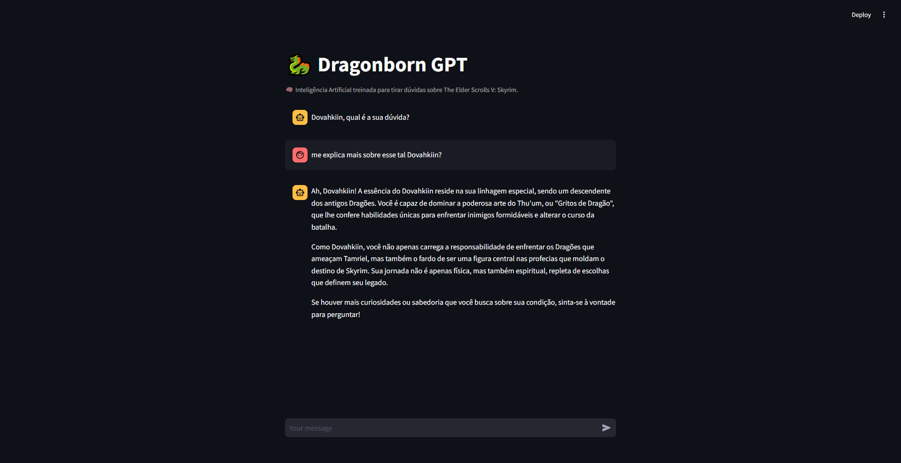

# Dragonborn GPT

Este é um projeto desenvolvido em Python, usando Streamlit, que utiliza inteligência artificial para responder dúvidas sobre o jogo The Elder Scrolls V: Skyrim. O projeto faz uso da estratégia de RAG (Retrieval-Augmented Generation) para buscar informações diretamente do manual do jogo, garantindo respostas precisas e relevantes.



### Preparação
É necessário acessar o Pinecone e configurar uma nova instância de banco de dados vetorial. Anote o `index-name` da sua instância, pois será necessária para configurar a conexão.

### Instalação
Clone o repositório:
```bash
git clone https://github.com/john-tavares/dragonborn-gpt.git
cd dragonborn-gpt
```
Instale as dependências:
```bash
pip install -r requirements.txt
```
Crie um arquivo `.env` na raiz do projeto e adicione suas chaves de API:
```bash
OPENAI_API_KEY=your_openai_api_key
PINECONE_API_KEY=your_pinecone_api_key
INDEX_NAME=tes-knowledge
```

### Execução
Após a configuração, você pode iniciar o aplicativo Streamlit:
```bash
streamlit run app.py
```

### Contribuições
Qualquer ajuda que agregue valor ao projeto, seja na edição do código-fonte ou nas documentações, e consequentemente a vida das pessoas é muito bem-vindo.